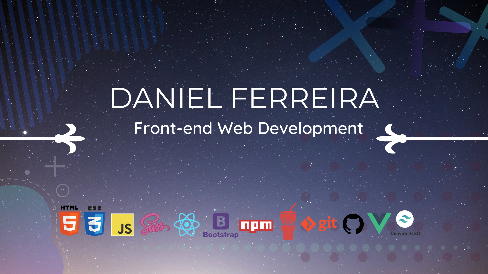

  

## Me chamo Daniel Freitas Ferreira 👋
Sou estudante de Análise e Desenvolvimento de Sistemas, pela universidade Unicesumar. 
Desenvolvedor front-end. 💻

- 🚀 Sou apaixonado por resolver problemas e aprender. Sempre aberto a novos desafios e pronto para enfrentar as mudanças.
- 🙌🏻 Adoro projetos Open Source e colaboro sempre que possivel.
- 🖥 Techs: HTML, CSS,Tecnologia BEM, JavaScript, SASS, Bootstrap 4, Gulp, Yarn, Npm, e Nvm. Focando em React.JS e Next.JS.
